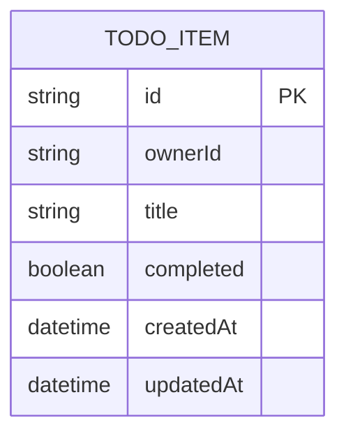

# Domain Model

The domain is a single entity: a to-do item owned by exactly one signed-in
user, identified by their Thunder subject id.

`ownerId` holds the caller's subject id from the signed sign-in assertion —
never a client-supplied value — so every query and mutation is scoped to the
signed-in user's own rows.