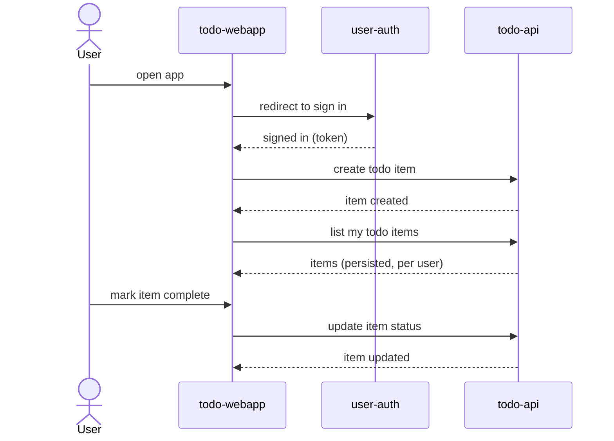

# Sign In and Manage Todos

A user signs in through Thunder, then adds and completes their own to-do items, which persist across devices.

```mermaid
sequenceDiagram
    actor User
    participant todowebapp as todo-webapp
    participant userauth as user-auth
    participant todoapi as todo-api

    User->>todowebapp: open app
    todowebapp->>userauth: redirect to sign in
    userauth-->>todowebapp: signed in (token)
    todowebapp->>todoapi: create todo item
    todoapi-->>todowebapp: item created
    todowebapp->>todoapi: list my todo items
    todoapi-->>todowebapp: items (persisted, per user)
    User->>todowebapp: mark item complete
    todowebapp->>todoapi: update item status
    todoapi-->>todowebapp: item updated
```

